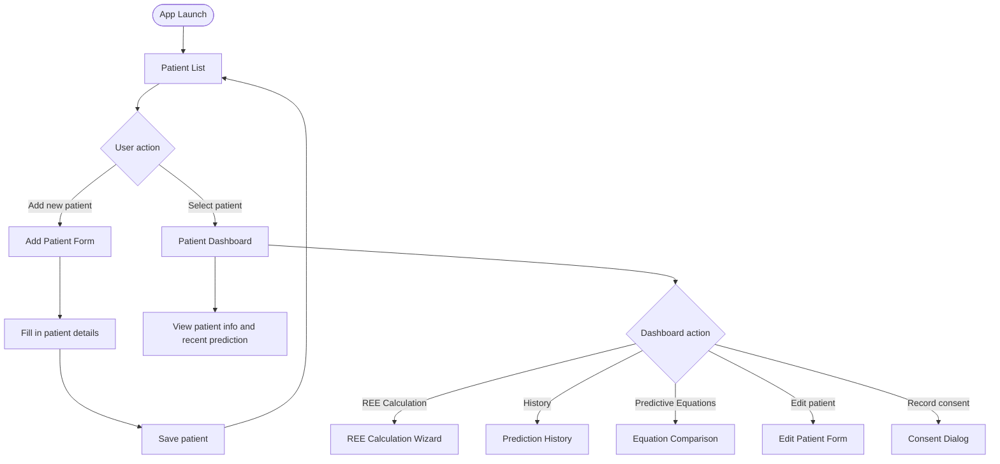
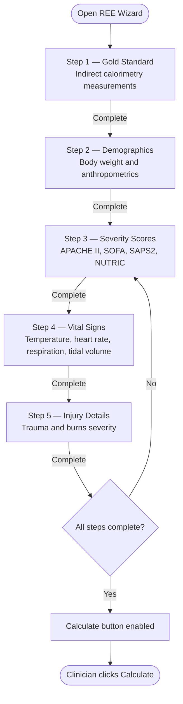
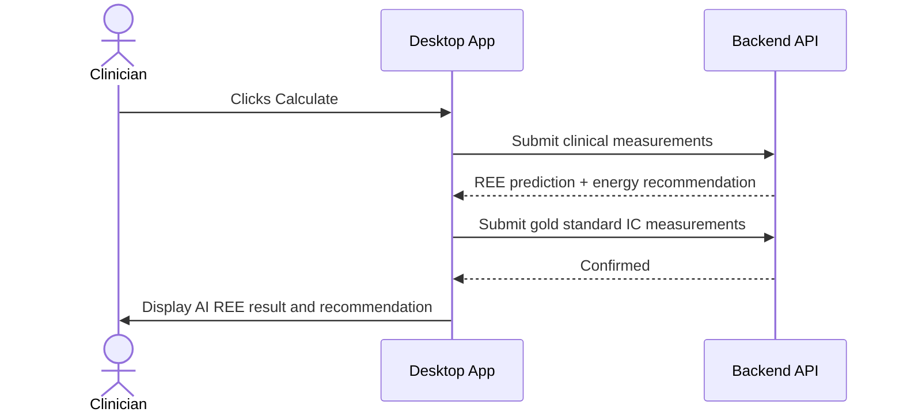
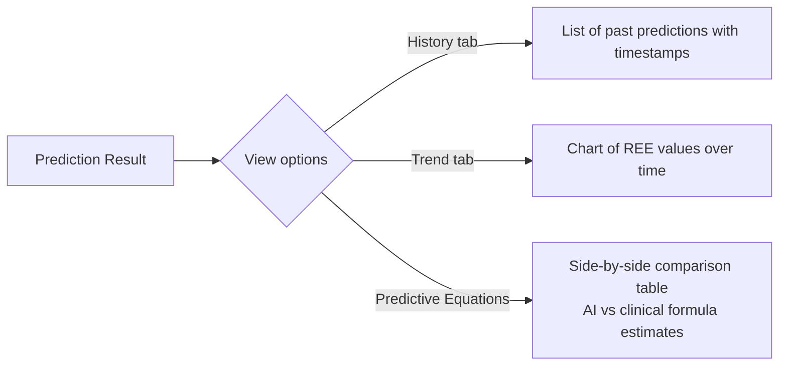

# frontend_innutrire — Flow Diagram

> A desktop application for ICU clinicians to register patients, enter clinical measurements, and receive AI-powered REE (Resting Energy Expenditure) predictions.

---

## Screen Navigation

---

## REE Calculation Wizard

---

## Prediction Submission & Result

---

## History & Comparison Views

