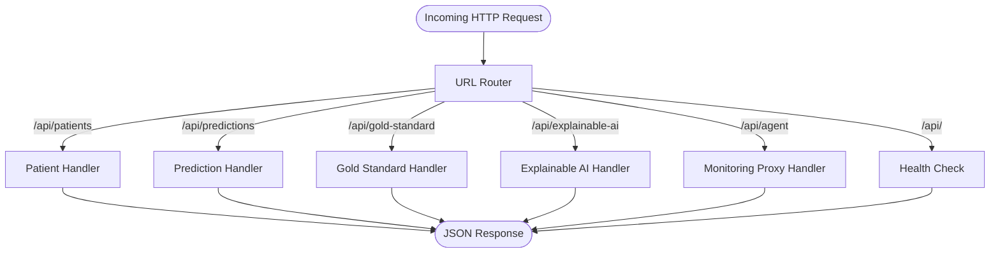
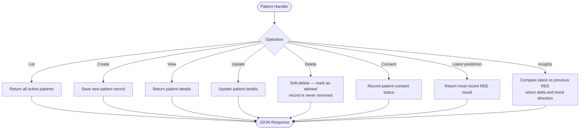
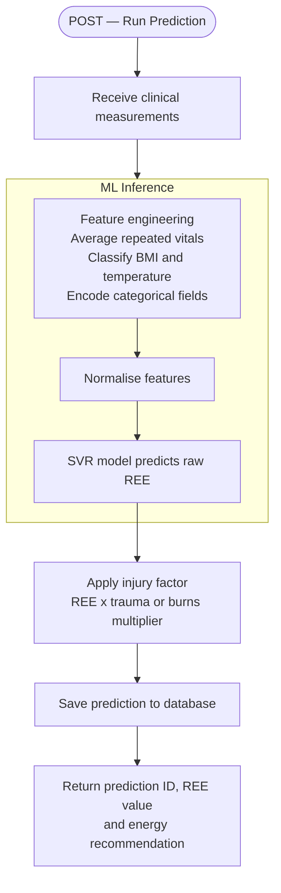
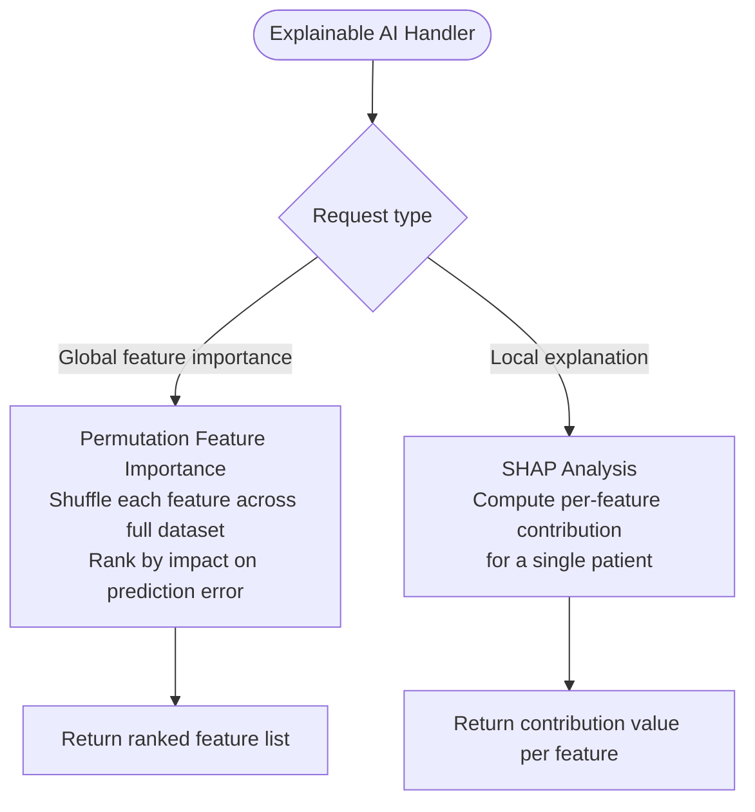
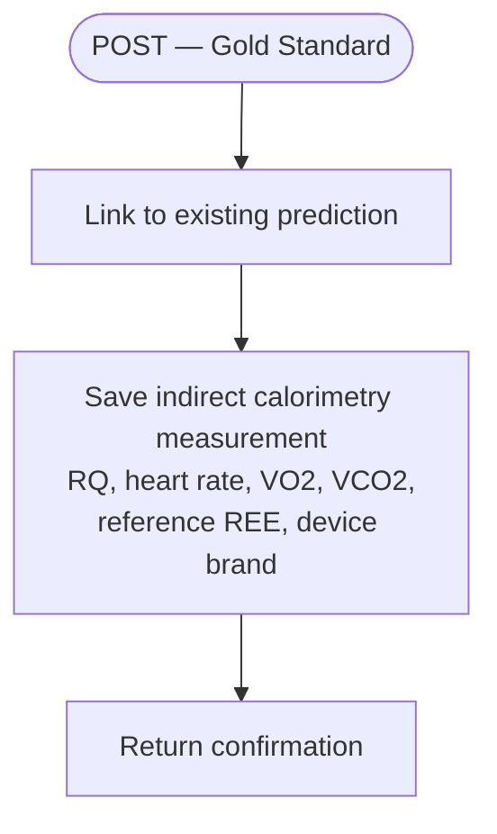
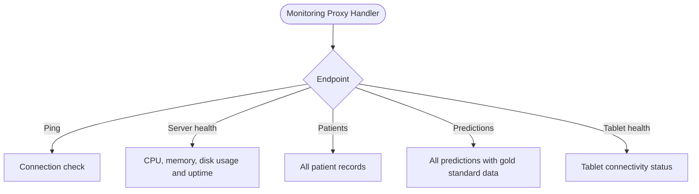
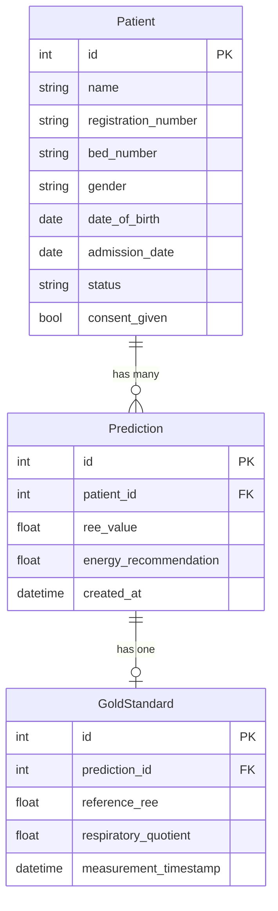
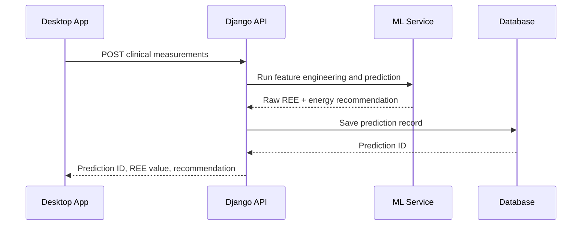

# django_backend_innutrire — Flow Diagram

> A Django REST API that manages patient records, runs ML inference to predict REE, serves explainable AI outputs, and proxies monitoring data for the Moniteer agent.

---

## API Routing Overview

---

## Patient Operations

---

## Prediction & ML Inference

---

## Explainable AI

---

## Gold Standard Recording

---

## Monitoring Proxy

---

## Data Model Relationships

---

## Full Request Lifecycle

