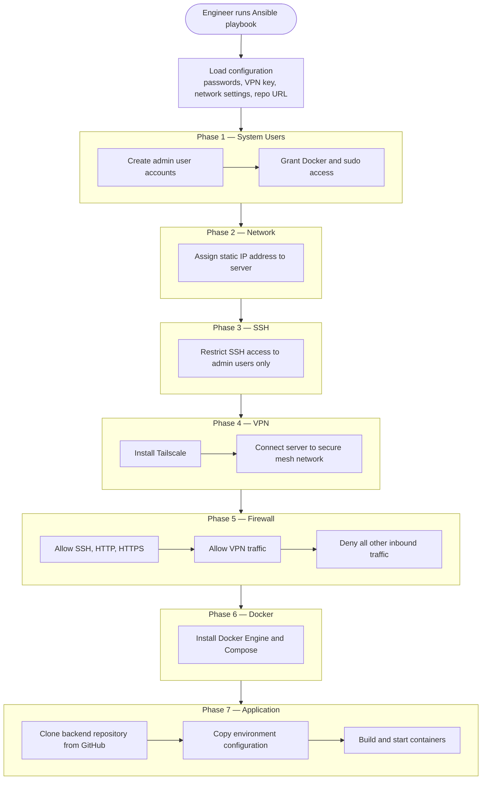
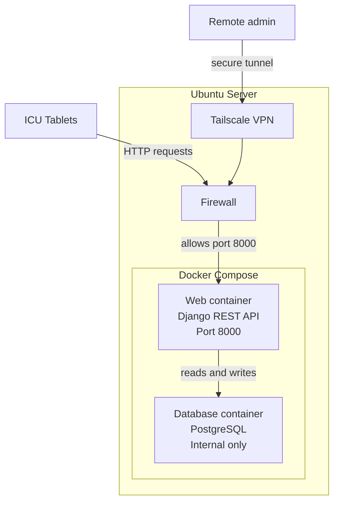
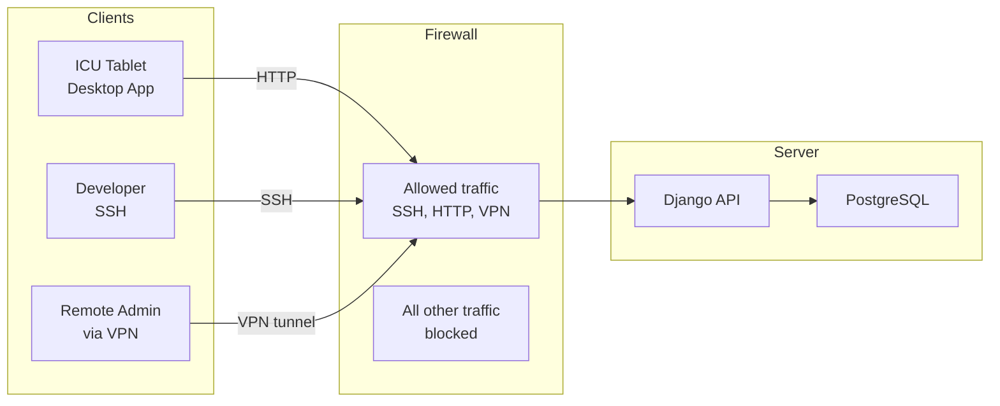

# hospital-server-deployment-iac — Flow Diagram

> Ansible playbooks that provision an on-premise Ubuntu server from scratch and deploy the Django backend via Docker Compose.

---

## Provisioning Flow

---

## Running Services

---

## Network Access

