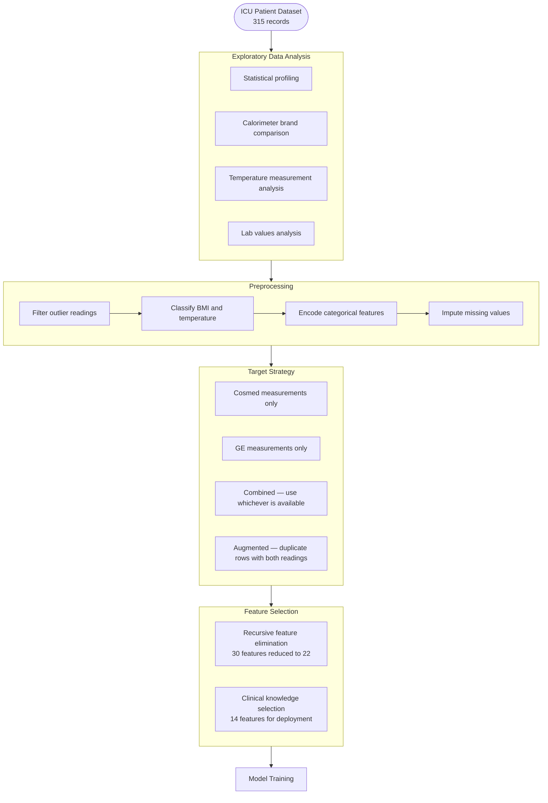
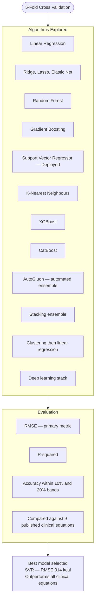
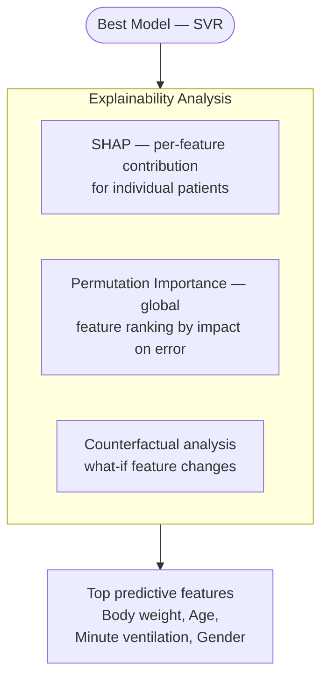
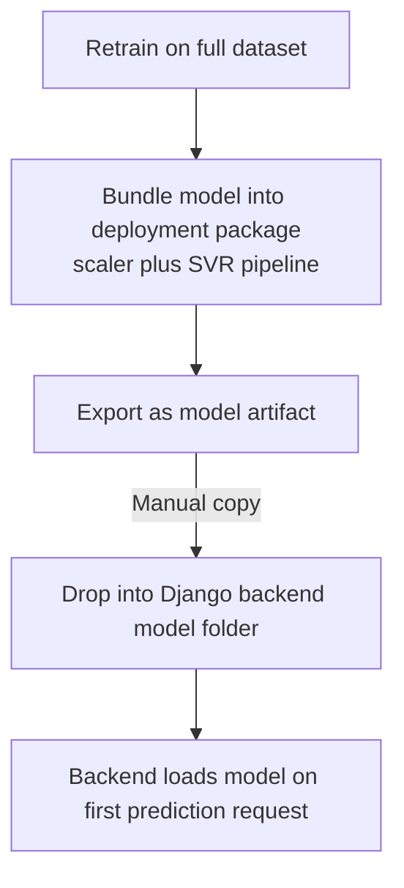

# Regression_models_innutrire — Flow Diagram

> ML research repository containing 87 Jupyter notebooks that explore data, compare regression algorithms, and produce the trained model deployed in the Django backend.

---

## Research Workflow

---

## Model Comparison

---

## Interpretability

---

## Model Export

