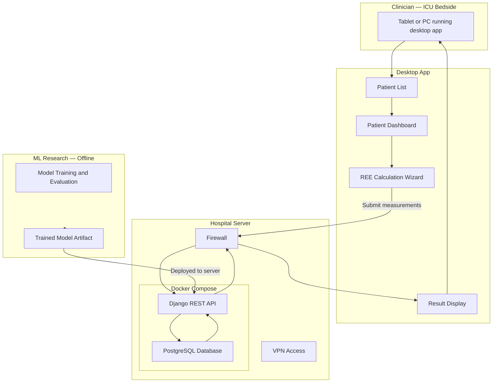
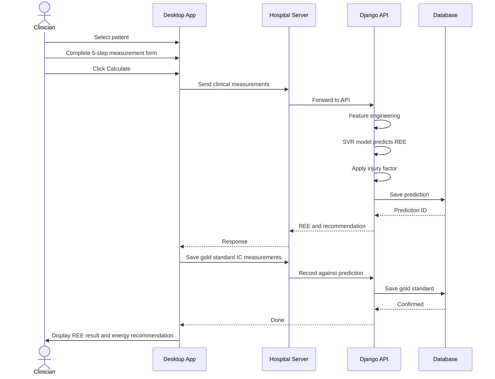
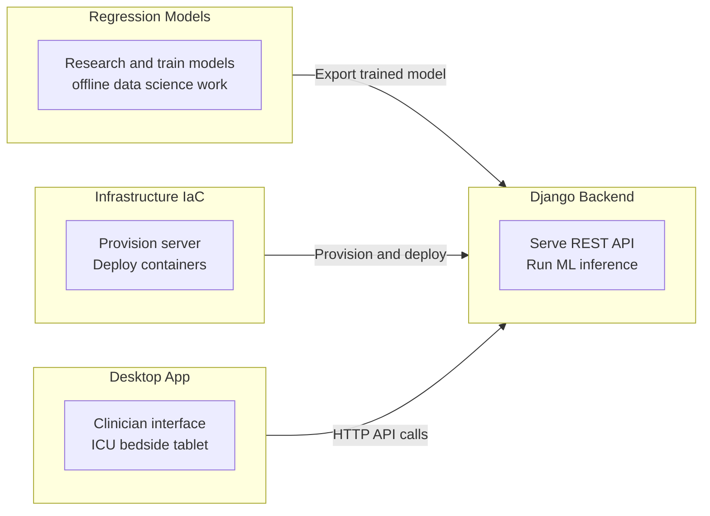
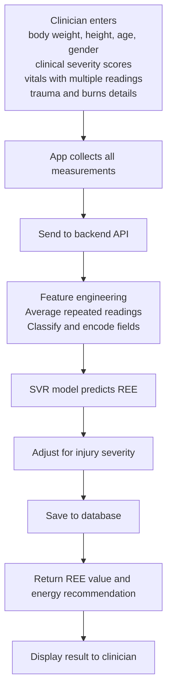
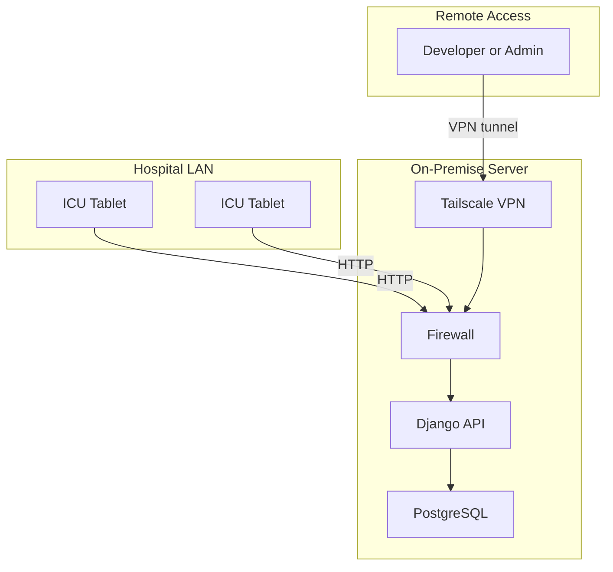

# INNUTRIRE — System Overview

> End-to-end flow from a clinician requesting a prediction to the result appearing on the bedside screen.

---

## System Architecture

---

## Prediction Request — Step by Step

---

## Repository Roles

---

## Data Flow — Vitals to Prediction

---

## Infrastructure Topology

