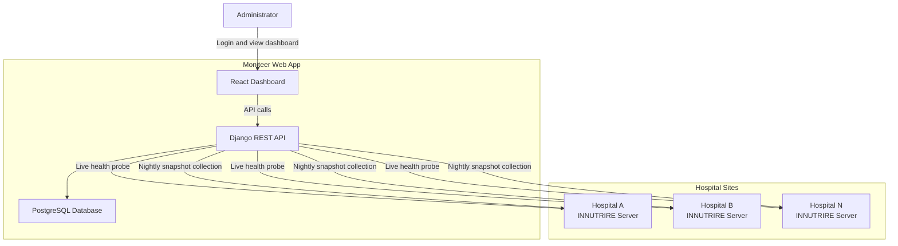
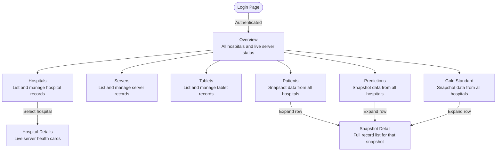
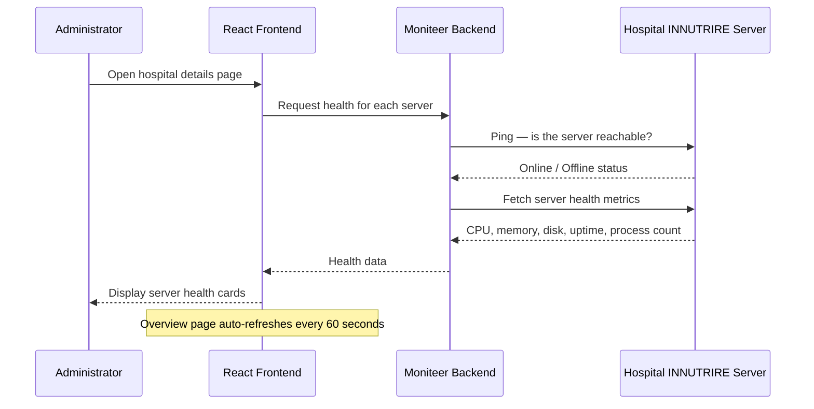
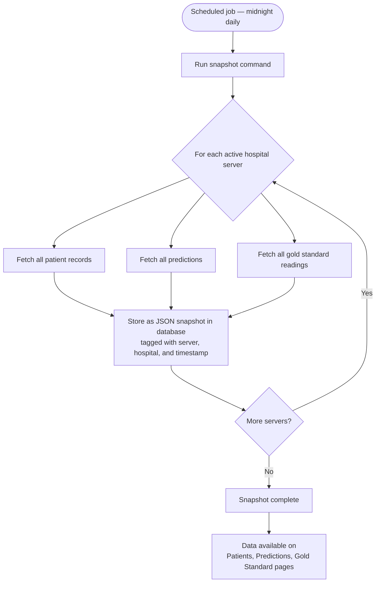
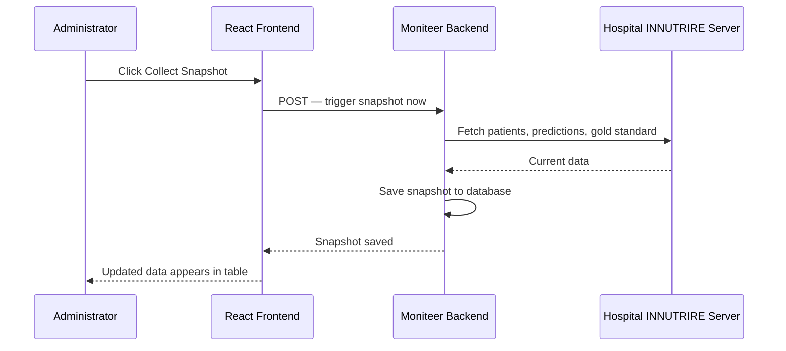
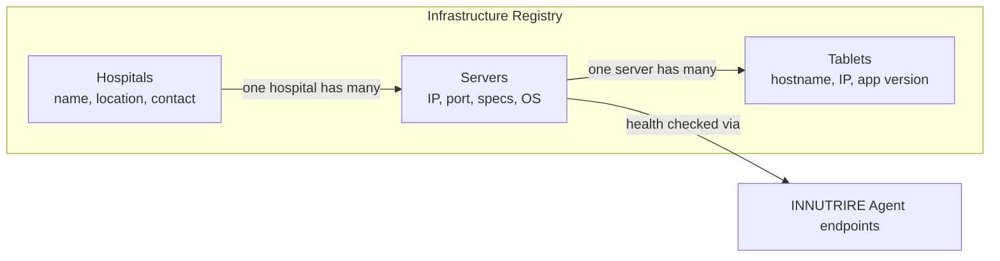
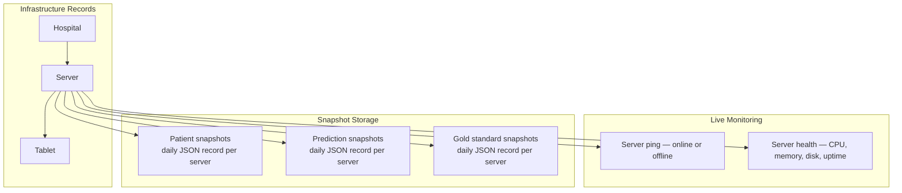
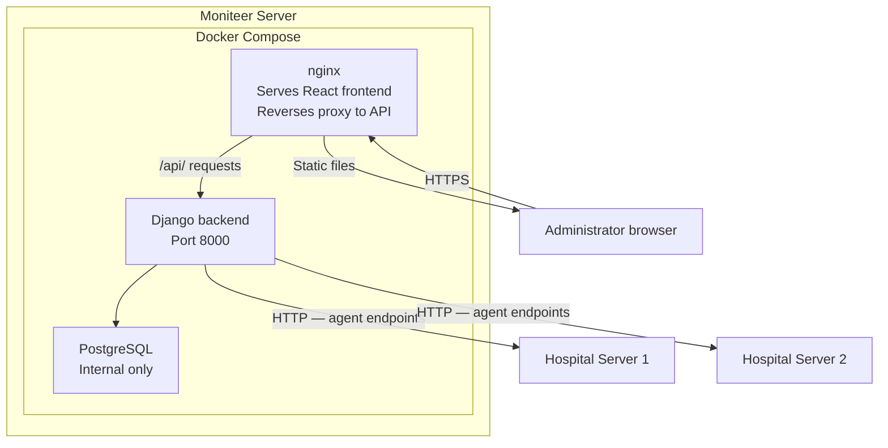

# moniteer — Flow Diagram

> A centralised web dashboard for monitoring all INNUTRIRE hospital deployments. It tracks infrastructure health, collects daily data snapshots from every hospital server, and gives administrators a single pane of glass across the entire network.

---

## Application Overview

---

## Page Navigation

---

## Live Server Health Monitoring

---

## Nightly Snapshot Collection

---

## Manual Snapshot Trigger

---

## Infrastructure Management

---

## Data Architecture

---

## Deployment Architecture

